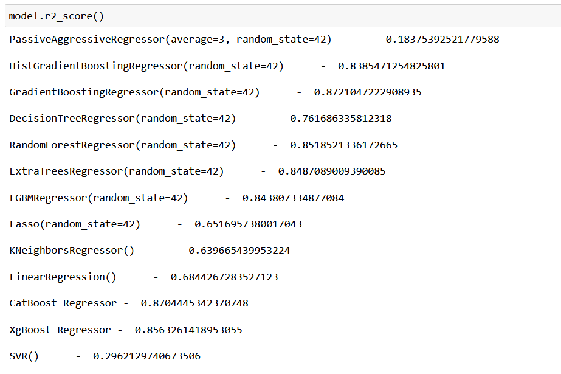
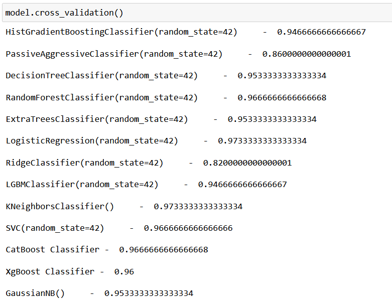

# Lazyme

- I created my own package named Lazyme. (coz I am🥱🥱)

- This package can be used in machine learning (Data Science) to check the performance of models.

- The best thing about this package is that you don’t have to train and predict every classification or regression algorithm to check performance. This package directly gives you output performance on different models.

- In Lazyme there are two classes present which is smart_classifier(For Classification problems) and smart_regressor (for Regression problems).
# Lazyme Package
- In Lazyme Package.IPYNB you can see how to use it.

# Lazyme for Classification: 
Lazyme will check the performance on this Classification models:
- Passive Aggressive Classifier
- Decision Tree Classifier
- Random Forest Classifier
- Extra Trees Classifier
- Logistic Regression
- Ridge Classifier
- K Neighbors Classifier
- Support Vector Classification
- Naive Bayes Classifier
- LGBM Classifier
- CatBoost Classifier
- XGB Classifier

And for classification problems Lazyme can give the output of:
- Accuracy Score.
- Classification Report
- Confusion Matrix
- Cross validation (Cross validation score)
- Mean Absolute Error
- Mean Squared Error
- Overfitting (will give accuracy of training and testing data.)
- Precision Score
- Recall Score

# Lazyme for Regression: 
Similarly, Lazyme will check performance on this Regression model:
- Passive Aggressive Regressor
- Gradient Boosting Regressor
- Decision Tree Regressor
- Random Forest Regressor
- Extra Trees Regressor
- Lasso Regression
- K Neighbors Regressor
- Linear Regression
- Support Vector Regression
- LGBM Regressor
- CatBoost Regressor
- XGB Regressor

And for Regression problem Lazyme can give an output of:
- R2 Score.
- Cross validation (Cross validation score)
- Mean Absolute Error
- Mean Squared Error
- Overfitting (will give accuracy of training and testing data.)

# How to use it:
- Download this Lazyme.py file and save it in your drive where Anaconda is located.
- Then just write from lazyme import smart_classifier, smart_regressor
- Then use it on any dataset.

# Model Images

#                                                                                    Thank You!!.
